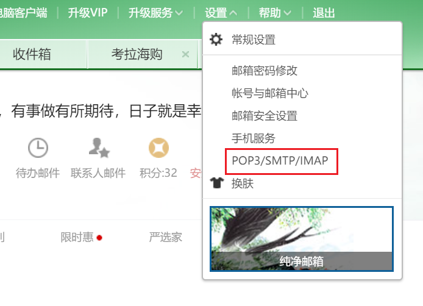
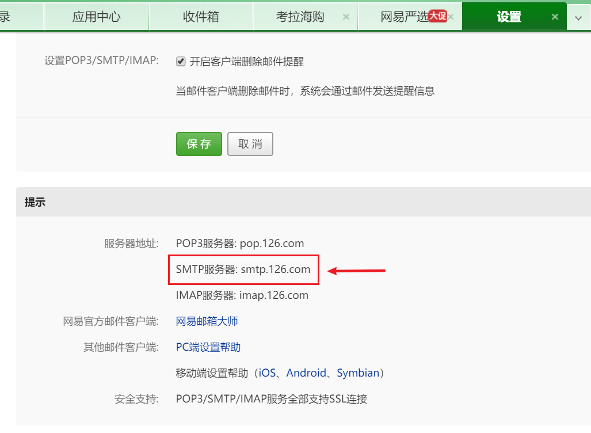
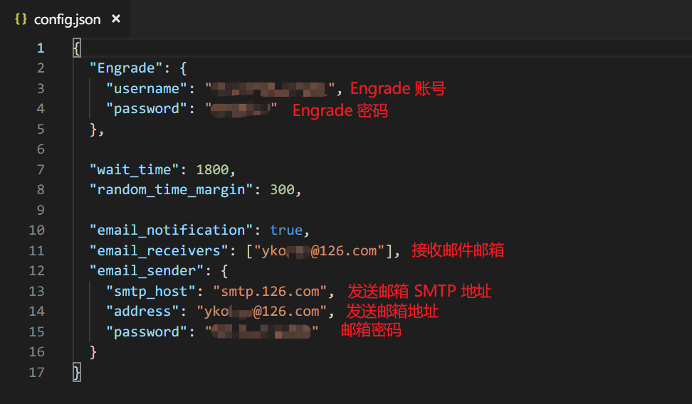
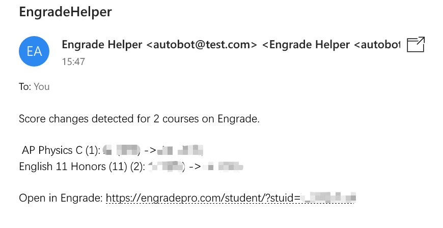

# EngradeHelper

这是一个基于 python 实现的 Engrade 助手。目前的功能为：

- 当 Engrade 上成绩发生变动时发送通知。

- 通知可以通过邮件和系统通知栏（仅支持 win10 和 mac）发送。

  

## 依赖

+ selenium库

+ win10toast库 （仅win10系统需要，用于发送通知）

+ [Chrome webdriver](http://chromedriver.chromium.org/downloads)

  **请将下载的 webdriver 放在与脚本同目录下，或者在程序中手动设置路径**


## 使用方法

直接运行程序或设置计划任务自动运行。目前支持一定时间间隔内检测成绩变化。未来会适配后台运行。

**但是在使用前请一定配置好 config.json**


### config.json 配置方法

用编辑器或记事本打开文件：

+ 在 ```Engrade``` 栏目下：
  + ```username``` 为 Engrade 账号名（字符串）。
  + ```password``` 为 Engrade 密码（字符串）。
+ ```wait_time``` 为两次检测期间等待时间，单位为秒（数字）。默认刷新时间是30分钟。
+ ```random_time_margin``` 为每次刷新时的随机时间浮动，单位为秒（数字）。默认上下浮动5分钟。
+ ```email_notification``` 为是否通过邮件通知（```true```或```false```，布尔值），若选择```false```则下面的选项都不用填写。
+ ```email_receivers``` 为通知邮件的接受者（列表），填写接收通知邮件的邮箱（可以多于一个）。
+ ```email_sender``` 设置发送邮件的邮箱，该栏目下：
  + ```smtp_host``` 是发送邮件邮箱 SMTP 服务器主机地址（字符串），一般可以在邮箱的设置内找到。比如126邮箱的 SMTP 地址如下：
  + ```address``` 为发送邮件的邮箱地址（字符串），注意要与上方使用的 SMTP 服务器匹配。
  + ```password``` 为登录该邮箱的密码（字符串）。

完整配置的示例如下：




以下是成功收到邮件的实例：


